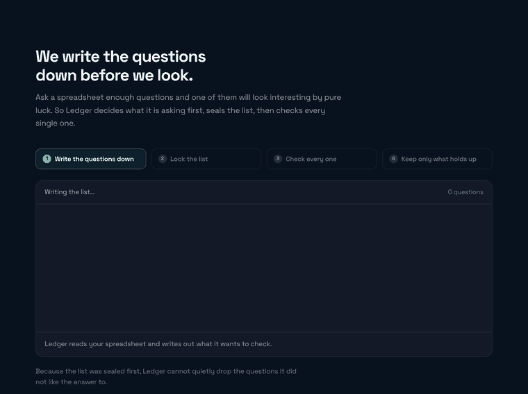
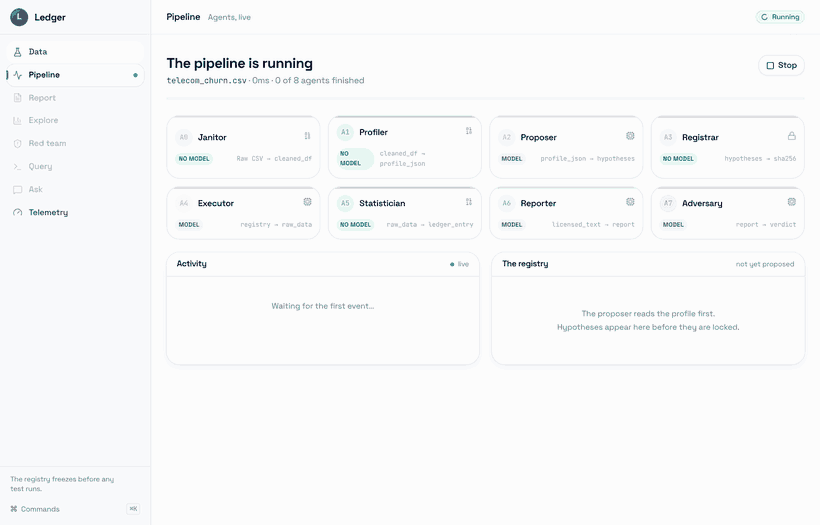

# Ledger

> **A production-grade, multi-agent AI data analyst that turns a CSV into statistically rigorous, peer-review-ready insights — and structurally refuses to report findings that statistics cannot support.**

<div align="center">

[](https://python.org)
[](https://fastapi.tiangolo.com)
[](https://react.dev)
[](https://ollama.com)
[](LICENSE)

**[Full Agentic Architecture →](./AGENTIC_ARCHITECTURE.md)** &nbsp;|&nbsp; **[Design System →](./DESIGN_SYSTEM.md)** &nbsp;|&nbsp; **[System Architecture →](./ARCHITECTURE.md)**

</div>

---

## What it does

Ask a spreadsheet enough questions and one of them will look interesting by pure
luck. Ledger writes its questions down first, seals the list, then checks every
one of them — so it cannot quietly drop the questions it did not like the answer
to.



Six questions go in. Two hold up. The other four could easily be coincidence, so
they are reported as tested-and-not-supported rather than dropped, because the
correction was computed across all six.

### A run, start to finish

Below is an actual recording of the deployed system analysing a 1,400-row table:
eight agents, the registry sealing with its hash, and the verdict. Nothing here
is a mock-up.



Note the badges on each agent. The stages that decide what is true — the
profiler, the registrar, the statistician — carry **NO MODEL**. The language
model proposes and phrases; it never adjudicates.

---

## The Problem We Solve

Every existing "chat with your CSV" tool has the same critical flaw: the LLM sees all the data, proposes tests, runs them, and picks the significant ones to report. This is **textbook p-hacking** — the most common cause of irreproducible scientific findings.

Ledger solves this with a structural guarantee, not a prompt engineering trick:

```
The LLM proposes. Deterministic statistics decides. 
The LLM cannot see results before hypotheses are frozen.
```

This is enforced at the **data model level** — not as a rule the LLM is asked to follow.

---

## Architecture in One Diagram

```
 CSV Upload
 │
 ▼
┌─────────────┐ ┌─────────────┐
│ A0 Janitor │───▶│ A1 Profiler │ ◀── Fully Deterministic (No LLM)
└─────────────┘ └──────┬──────┘
 │ Profile JSON (schema only, no raw data)
 ▼
 ┌─────────────┐ ┌──────────────┐
 │ A2 Proposer │◀───│ RAG: Data │ ◀── LLM + RAG
 │ (LLM) │ │ Dictionary │
 └──────┬──────┘
 │ Hypotheses
 ▼
 ┌─────────────┐
 │ A3 Registrar│ ◀── FREEZE POINT
 │ [IMMUTABLE] │ No new hypotheses after this
 └──────┬──────┘
 │ Registered H01...H12
 ▼
 ┌───────────────────────┐
 │ A4 Executor (LLM) │ ReAct Loop: Think→Code→Run→Fix
 │ + Secure Sandbox │ (up to 3 self-repair attempts)
 └───────────┬───────────┘
 │ Raw data (group_a, group_b, x_values...)
 ▼
 ┌───────────────────────┐
 │ A5 Statistician │ ◀── Fully Deterministic
 │ - Assumption checks │ Welch / Mann-Whitney / Chi²
 │ - Test selection │ Cohen's d / Cramér's V
 │ - BH FDR correction │ licensed_text generated here
 └───────────┬───────────┘
 │ licensed_text (ONLY text A6 can use)
 ▼
 ┌───────────────────────┐
 │ A6 Reporter (LLM) │ Grounded — cannot cite unverified facts
 └───────────┬───────────┘
 │ Draft report
 ▼
 ┌───────────────────────┐
 │ A7 Adversary (LLM) │ Red-team: finds causal language,
 │ [Red Team Agent] │ phantom findings, effect overstatement
 └───────────┬───────────┘
 Pass ◀─┤─▶ Fail → A6 rewrites (max 2 rounds)
 │
 ▼
 FINAL REPORT
 (HTML + Jupyter Notebook)

 ─── Parallel Agents ─────────────────────────────────────
 A10 Visual Analyst → Plotly dashboard (runs after A0)
 A9 SQL Converter → NL→SQL + Mermaid flowchart (on-demand)
 A8 Meta-Agent → Self-improving loop (background, scheduled)
```

---

## [Full Agentic Architecture Document →](./AGENTIC_ARCHITECTURE.md)

The architecture document covers everything a senior engineer or professor needs to understand or replicate this system:

| Section | What's Covered |
|---------|---------------|
| [Agent Deep-Dives](./AGENTIC_ARCHITECTURE.md#agent-deep-dives) | Every agent's exact inputs, outputs, prompts, and decision logic |
| [Tool Calling & Function Chains](./AGENTIC_ARCHITECTURE.md#tool-calling--function-chains) | How agents call tools and chain outputs |
| [ReAct Loop (A4)](./AGENTIC_ARCHITECTURE.md#react-reasoning--acting-loop) | Think → Code → Run → Observe → Repair with full trace |
| [RAG Architecture](./AGENTIC_ARCHITECTURE.md#rag-architecture) | Document ingestion, embedding, retrieval pipeline |
| [Multi-Agent Orchestration](./AGENTIC_ARCHITECTURE.md#multi-agent-orchestration) | SSE streaming, state machine, session management |
| [Self-Improving Loop (A8)](./AGENTIC_ARCHITECTURE.md#a8-meta-agent--self-improving-loop) | Telemetry → pattern detection → prompt patching |
| [NL → SQL Pipeline (A9)](./AGENTIC_ARCHITECTURE.md#a9-nl--sql--mermaid-flowchart) | Full query conversion with live execution |
| [Observability Pipeline](./AGENTIC_ARCHITECTURE.md#observability--telemetry-pipeline) | Every agent event logged, queried, and fed back |
| [Evaluation Framework](./AGENTIC_ARCHITECTURE.md#evaluation-framework) | NULLSET, PLANTED, REALKNOWN, REALWILD suites |
| [Security & Sandbox](./AGENTIC_ARCHITECTURE.md#security--sandbox) | Forbidden keyword scanner, thread isolation |

---

## Feature Highlights

| Feature | How It Works |
|---------|-------------|
| **Zero p-hacking** | A3 freeze makes post-hoc hypothesis addition a runtime error |
| **No causal hallucination** | A7 red-team audits every sentence — rewrites until clean |
| **Self-improving** | A8 reads failure telemetry and patches agent prompts autonomously |
| **RAG grounding** | Upload a data dictionary → A2 knows what `q3` means |
| **NL → SQL + Diagram** | "Show me top 10 customers by revenue" → SQL + Mermaid flowchart |
| **Live visualization** | A10 auto-generates Plotly distributions, heatmaps, time series |
| **Real-time streaming** | SSE stream shows every agent activating live in the UI |
| **Reproducible** | Same CSV → same hash. Different hash → warning surfaced to user |
| **Multi-turn chat** | Ask "Why did H07 fail?" — grounded answer from the ledger only |

---

## Quick Start

### Prerequisites
- Python 3.12+
- Node.js 20+
- A model host — one of:
 - **[Ollama](https://ollama.com) running locally** (recommended). Nothing leaves
 the machine, which is the configuration the project's privacy claim depends on.
 - An **Ollama Cloud** key, for when the data is not sensitive.
 - A **Groq** or **Gemini** key as a fallback.

### Backend

```bash
cd backend
pip install -r requirements.txt
cp .env.example .env
# Set ONE of: OLLAMA_HOST (local), OLLAMA_API_KEY, GROQ_API_KEY, GEMINI_API_KEY
uvicorn main:app --reload --port 8000
```

Providers are tried in order: **Ollama → Groq → Gemini**. A local Ollama daemon
takes priority over the hosted service. If a model is unavailable to your key
(Ollama Cloud answers `402` for models outside your tier), the client falls back
to `OLLAMA_MODEL` rather than failing the run.

### Frontend

```bash
cd frontend
npm install
npm run dev
# Opens at http://localhost:5173
```

### Verify It's Running

```bash
curl http://localhost:8000/api/health
# {"status":"healthy","groq_configured":false,"active_sessions":0}
```

---

## API Reference

### Core Flow

```bash
# 1. Create a session
curl -X POST http://localhost:8000/api/sessions/create

# 2. Upload CSV and stream the pipeline
curl -X POST http://localhost:8000/api/sessions/{id}/upload \
 -F "file=@your_data.csv" \
 --no-buffer # SSE stream

# 3. Get the complete report
curl http://localhost:8000/api/sessions/{id}/report
```

### All Endpoints

| Method | Endpoint | Description |
|--------|----------|-------------|
| `GET` | `/api/health` | Health check + config status |
| `POST` | `/api/sessions/create` | Create analysis session |
| `POST` | `/api/sessions/{id}/upload` | Upload file → SSE pipeline stream |
| `GET` | `/api/sessions/{id}/status` | Current stage + token usage |
| `GET` | `/api/sessions/{id}/report` | Full report + ledger + dashboard |
| `POST` | `/api/sessions/{id}/sql` | NL → SQL + Mermaid flowchart |
| `POST` | `/api/sessions/{id}/hypotheses` | Add user hypotheses (pre-freeze) |
| `POST` | `/api/sessions/{id}/chat` | Grounded multi-turn Q&A |
| `GET` | `/api/sessions/{id}/telemetry` | Agent, hypothesis and adversary events for one session |
| `GET` | `/api/sessions/{id}/notebook` | Download the session as a runnable Jupyter notebook |
| `GET` | `/api/sessions/{id}/export/report.html` | Download a standalone HTML report |
| `GET` | `/api/admin/sessions` | List all active sessions |
| `GET` | `/api/admin/telemetry/overview` | Cross-session telemetry + recurring failure patterns |
| `GET` | `/api/admin/prompt-versions` | A8's prompt evolution history |
| `POST` | `/api/admin/meta-agent/run` | Trigger A8 self-improvement |

---

## The Interface

Eight screens, built around one interaction: **every sentence in the report links
to the ledger entry that licensed it.** Click a claim and the receipt opens — the
code that ran, the assumptions that were checked, the test those assumptions
selected, the effect size, and the FDR-adjusted p-value.

| Screen | What it does |
|--------|--------------|
| **Data** | Upload a CSV/Excel file or link a Google Sheet. Attach a data dictionary for RAG. Add your own hypotheses — before the freeze, which is the only time the registry will accept them. |
| **Pipeline** | The agents running live over SSE, with the registry filling up and the freeze landing in real time. |
| **Report** | The prose, the ledger, and three charts: the Benjamini–Hochberg staircase, effect sizes ordered by magnitude, and the p-value distribution. |
| **Explore** | A10's exploratory dashboard — clearly marked as *not findings*, because nothing there is corrected for multiple comparisons. |
| **Red team** | What A7 flagged, whether or not the rewrite resolved it. |
| **Query** | Ask in English, get SQL, a Mermaid query plan, and the rows. |
| **Ask** | Follow-up questions answered from the ledger only. |
| **Telemetry** | Timings, tokens, failures, and the A8 self-improvement loop. |

### The Benjamini–Hochberg staircase

The chart that shows the architecture. Every registered hypothesis is plotted
against the critical line `i·q/m` — including the ones that failed. `m` is fixed
at the freeze, before any result is seen, so it sets how permissive the threshold
is. Dropping the failures would shrink `m` and raise the line, which is precisely
what plotting all of them makes impossible to hide.

### Accessibility

Status is never communicated by colour alone. `#059669` (supported) and
`#e11d48` (error) sit at ΔE 5.8 under deuteranopia — indistinguishable for
roughly 8% of men — so every verdict ships with an icon and a word. The
categorical chart palette is validated for CVD separation, lightness band and
contrast rather than chosen by eye.

---

## Repository Structure

```
Ledger_agent/
│
├── README.md ← You are here
├── AGENTIC_ARCHITECTURE.md ← Full architecture deep-dive
├── DESIGN_SYSTEM.md ← UI/UX specifications
├── ARCHITECTURE.md ← System overview
│
├── backend/
│ ├── main.py ← FastAPI app + all routes
│ ├── requirements.txt
│ ├── .env.example ← Environment variable template
│ │
│ ├── core/
│ │ ├── ledger.py ← Central Pydantic data model
│ │ ├── state_machine.py ← Async SSE pipeline orchestrator
│ │ ├── sandbox.py ← Secure Python executor
│ │ ├── llm_client.py ← Groq → Gemini fallback client
│ │ └── session_store.py ← In-memory session registry
│ │
│ ├── agents/
│ │ ├── a0_janitor.py ← Data cleaning + domain detection
│ │ ├── a1_profiler.py ← Deterministic statistical profiler
│ │ ├── a2_proposer.py ← LLM hypothesis proposer + RAG
│ │ ├── a3_registrar.py ← Registry freeze + hash
│ │ ├── a4_executor.py ← ReAct code executor + self-repair
│ │ ├── a5_statistician.py ← Test selection + FDR correction
│ │ ├── a6_reporter.py ← Grounded prose reporter
│ │ ├── a7_adversary.py ← Red-team auditor
│ │ ├── a8_meta_agent.py ← Self-improving loop
│ │ ├── a9_sql_converter.py ← NL → SQL + Mermaid
│ │ └── a10_visual_analyst.py ← Full Plotly dashboard
│ │
│ ├── rag/
│ │ └── document_ingestor.py ← Document parsing + retrieval
│ │
│ ├── observability/
│ │ ├── models.py ← SQLAlchemy ORM models
│ │ └── telemetry.py ← Context-manager event logger
│ │
│ └── prompts/
│ └── templates.py ← Versioned, A8-evolvable prompts
│
└── frontend/
 ├── src/
 │ ├── App.jsx ← Hash router + boot sequence
 │ ├── index.css ← Tailwind v4 @theme — every design token
 │ │
 │ ├── lib/
 │ │ ├── api.js ← REST + SSE-over-POST reader
 │ │ ├── store.js ← Zustand session state
 │ │ ├── report.js ← HTML sanitiser + claim→entry binding
 │ │ ├── agents.js ← The agent roster, one source of truth
 │ │ ├── highlight.js ← Small Python/SQL tokeniser
 │ │ └── format.js ← p-values, effect sizes, durations
 │ │
 │ ├── components/
 │ │ ├── views/ ← Setup, Pipeline, Report, Explore,
 │ │ │ Adversary, SqlLab, Ask, Telemetry
 │ │ ├── charts/ ← BHStaircase, EffectForest,
 │ │ │ PValueHistogram, AgentTimings, …
 │ │ ├── ui/ ← Button, StatusPill, CodeBlock,
 │ │ │ chart.jsx (shadcn/Recharts primitives)
 │ │ ├── LedgerCard.jsx ← The receipt behind a claim
 │ │ ├── BootSequence.jsx ← Cinematic load
 │ │ └── CommandPalette.jsx ← ⌘K
 │ └── ...
 ├── package.json
 └── vite.config.js
```

---

## Environment Variables

One model host is required. Everything else has a working default.

| Variable | Description |
|----------|-------------|
| `OLLAMA_HOST` | Local Ollama daemon, e.g. `http://localhost:11434`. Preferred — no data egress. |
| `OLLAMA_API_KEY` | Ollama Cloud key. Used only when `OLLAMA_HOST` is unset. |
| `OLLAMA_MODEL` | General reasoning — A2, A6, A7, A8. Default `gpt-oss:120b`. |
| `OLLAMA_CODE_MODEL` | Code generation — A4, A9. Falls back to `OLLAMA_MODEL` if out of tier. |
| `OLLAMA_TIMEOUT_S` | Request timeout in seconds. Default `180`. |
| `GROQ_API_KEY` | Fallback provider. |
| `GEMINI_API_KEY` | Second fallback. |
| `DATABASE_URL` | Telemetry database. Default `sqlite:///./ledger_telemetry.db`. |

---

## Evaluation Framework

Ledger is evaluated against 4 benchmark suites (see [Architecture Doc](./AGENTIC_ARCHITECTURE.md#evaluation-framework)):

| Suite | Size | What It Tests |
|-------|------|---------------|
| **NULLSET** | 200 tables of pure noise | False positive rate (correct answer = 0 findings) |
| **PLANTED** | 300 tables with known relationships | True positive rate + effect size accuracy |
| **REALKNOWN** | ~20 public datasets | Agreement with documented scientific findings |
| **REALWILD** | ~30 unseen public datasets | Expert-adjudicated real-world performance |

---

## Contributing

1. Fork the repository
2. Create a feature branch: `git checkout -b feat/your-feature`
3. Commit with conventional commits: `git commit -m "feat: add X"`
4. Push and open a Pull Request

Please read [AGENTIC_ARCHITECTURE.md](./AGENTIC_ARCHITECTURE.md) before contributing to understand the agent contracts and invariants.

---

## License

MIT © 2026 [kumardhruv88](https://github.com/kumardhruv88)

---

<div align="center">

**[Read the Full Architecture →](./AGENTIC_ARCHITECTURE.md)**

*Built as a B.Tech Project (BTP) — solving the multiple comparisons problem in LLM-based data analysis.*

</div>
